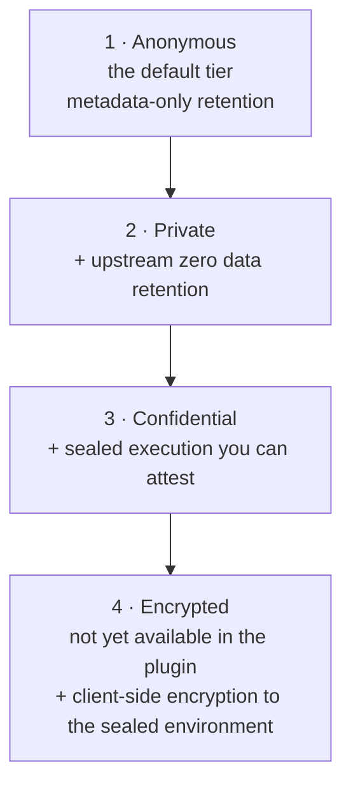

Nito lets you choose how private each call is, and that choice rides on the model you select rather than being set once for your whole session. This section is the authoritative reference: one page per tier, going deeper into what each one protects, how you reach it from the plugin, and the trade-offs you accept when you pick it.

## Each Privacy Tier Builds on the Last

Read the four tiers as a ladder. Each rung adds a stronger guarantee and, in exchange, narrows the set of models and features available to you. You climb only as high as a given call needs.

| **Tier** | **How you reach it** | **Core guarantee it adds** |
| :-- | :-- | :-- |
| **Anonymous** | Pick a model whose tier is Anonymous | Metadata-only retention by default |
| **Private** | Pick a model whose tier is Private | Upstream provider held to zero data retention |
| **Confidential** | Pick a model that offers Confidential | Sealed execution with a verifiable attestation |
| **Encrypted** | Not yet available in the plugin | Client-side encryption to the sealed environment |

Each higher tier keeps the guarantees of the ones below it and adds its own. Confidential runs inside a sealed environment (a Trusted Execution Environment) that you can attest; Encrypted keeps that sealed execution and additionally encrypts your data to it.

## The Tier Follows the Model You Choose

You do not type a suffix or flag to pick a tier. Every model carries its own privacy tier, and you get the tier of the model you choose. Browse the catalog with the `models` command, then set your model with `model` or `--model`. The tier comes along with it.

- **Anonymous and Private** are properties of the model itself. When you pick the model, you get its tier: a model's privacy reach is shown when you browse.
- **Confidential** is available on models that offer sealed execution. Pick one of those models and your calls run in the sealed environment.
- **Encrypted** is the top rung and is not yet available in the plugin.

Because the tier is bound to the model, the way to change the privacy of a call is to change the model, nothing else.

## Which Privacy Tiers a Model Offers

No model supports every tier. When you browse models, the catalog marks which models offer each tier, and the practical rule is always the same: read the model's listing, then choose the tier the model supports.

- **Anonymous / Private** is the model's own stored tier. You do not do anything extra; picking the model gives you its tier.
- **Confidential** is available on models the catalog marks as offering sealed, attestable execution. Pick one of those models to run there.
- **Encrypted** is not yet available in the plugin.

A privacy tier never silently downgrades. If a request cannot be served at the chosen model's tier, the call fails with a clear message rather than dropping to a weaker tier. A guarantee that quietly weakens is worse than no guarantee, so the request is refused instead.

_Each rung keeps the guarantees of the rungs below it and adds its own. Support is decided per model: browse the catalog, see which tiers a model offers, then choose the tier the model supports._

## How to Read the Rest of this Section

Start with the tier closest to your need and climb from there:

- [**Anonymous**](/privacy/tiers/anonymous) the lightest tier and the default. Broad model availability, metadata-only retention.
- [**Private**](/privacy/tiers/private) privately served models with no upstream retention.
- [**Confidential**](/privacy/tiers/confidential) sealed execution with an attestation you can fetch and verify. Supports streaming.
- [**Encrypted**](/privacy/tiers/encrypted) the top rung: client-side encryption to the sealed environment. Not yet available in the plugin.

## Related Resources

<CardGroup cols={3}>
  <Card title="Privacy Overview" icon="shield-check" href="/privacy/overview">
    What "private" means on Nito. 
  </Card>

  <Card title="Choosing a Model" icon="cubes-stacked" href="/commands/choosing-a-model">
    Browse models and set the one you want.
  </Card>

  <Card title="What Each Command Protects" icon="phone-circle" href="/privacy/what-each-command-protects">
    How privacy applies across the plugin's commands. 
  </Card>

  <Card title="TEE Attestation" icon="stamp" href="/privacy/tee-attestation">
    How Nito turns a privacy promise into something you can check. 
  </Card>

  <Card title="Data Retention and Visibility" icon="id-card" href="/privacy/data-retention-and-visibility">
    What Nito retains and what it does not.  
  </Card>

  <Card title="How It Works" icon="gears" href="/get-started/how-it-works">
    How the plugin routes your calls and how the tier follows the model.
  </Card>
</CardGroup>
